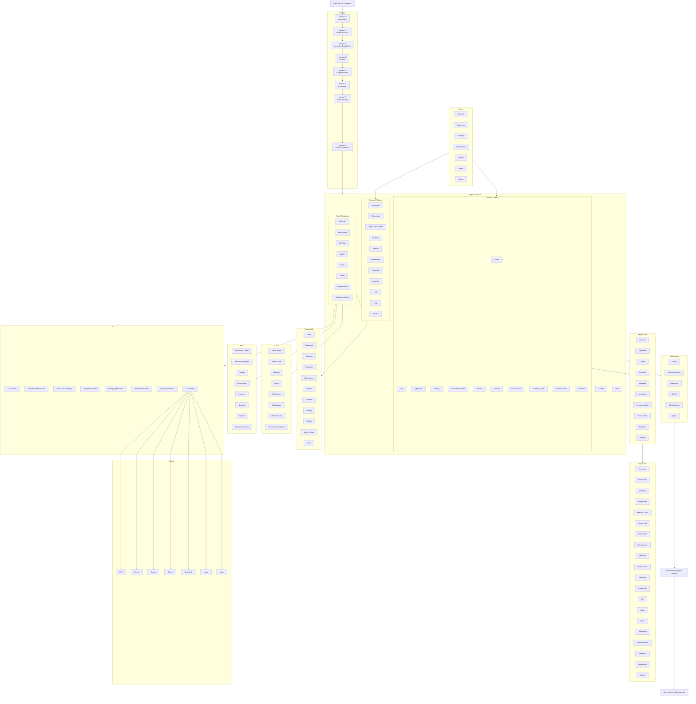

# DairyTwinOS Enterprise Master Architecture

This document captures the DairyTwinOS enterprise architecture roadmap, project structure, platform components, user roles, deployment path, and final production deliverable.

